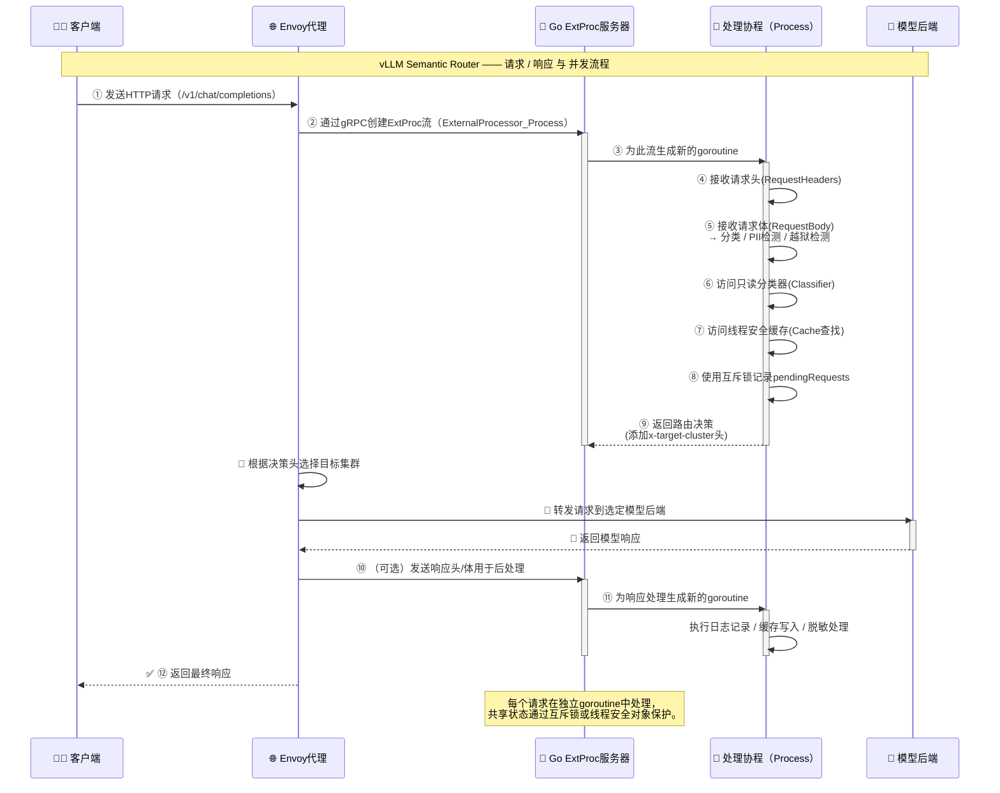
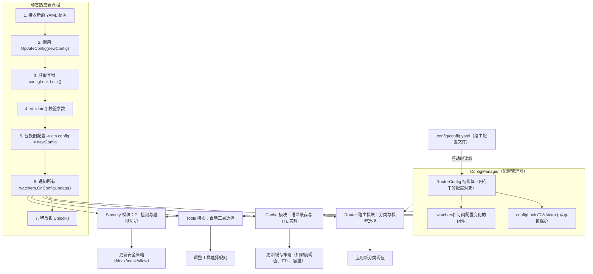

# @semantic-router 系统架构

语义路由器以 Envoy Proxy 为基础，采用复杂的混合模型（MoM）架构，并配备提供智能路由能力的外部处理器（ExtProc）服务。

这种设计确保了生产级大型语言模型（LLM）部署具备高性能、可扩展性和可维护性。

### 架构概述


- ​**Client → Envoy(HTTP) → ExtProc(gRPC 回调) → Envoy 执行路由决策 → 目标模型后端**。
- Envoy 负责连接管理、负载均衡、健康检查、超时与**路由头**的应用；
- ExtProc 负责“看懂请求内容 + 分类 + 安全检查 + 缓存命中 + 工具选择”，并把“去哪儿”告诉 Envoy。

‍

### 核心组件

#### Envoy Proxy — 流量管理层

- 担任所有 LLM 请求的入口点和流量指挥。
- 主要职责包括：

  - **负载均衡**：将请求分发到多个后端模型端点。
  - **健康检查**：监控各后端模型服务的可用性与状态。
  - **请求/响应处理**：管理 HTTP 协议、头管理、超时设置等。
- 文档中还给出了一个 Envoy listener 的配置示例（监听端口、http\_filters 配置等）以说明如何集成 ext\_proc filter

  ```yaml
  # Envoy listener configuration
  listeners:
  - name: listener_0
    address:
      socket_address:
        address: 0.0.0.0
        port_value: 8801  # Main entry point

  http_filters:
  - name: envoy.filters.http.ext_proc # 启用 HTTP ExtProc 过滤器，把请求“外包”给 gRPC 的外部处理器
    typed_config:
      grpc_service:
        envoy_grpc:
          cluster_name: extproc_service # 指向 ExtProc 后端的集群名
      processing_mode:
        request_header_mode: "SEND" # 请求/响应头都会发给 ExtProc 以便决策或观测
        response_header_mode: "SEND"     
        request_body_mode: "BUFFERED" # 把整个 Body 缓冲后再交给 ExtProc 分析(让分类器拿到完整上下文)
        response_body_mode: "BUFFERED"   
  ```

‍

#### Semantic Router ExtProc 服务 — 智能路由层

- 这是系统的大脑，负责做“智能路由决策”。
- 架构示例（Go 语言）中有 `OpenAIRouter` 结构体，包含：

  ```go
  type OpenAIRouter struct {
      Config               *config.RouterConfig // 热更新配置的落点（模型端点、缓存参数、阈值等）
      CategoryDescriptions []string             // 类别描述语料，辅助分类/解释
      Classifier           *classification.Classifier   // ModernBERT 为底座的多任务分类器。
      PIIChecker           *pii.PolicyChecker           // PII 检测/策略执行（遮盖/阻断/放行）。
      Cache                *cache.SemanticCache         // 语义缓存（复用常见问答）。
      ToolsDatabase        *tools.ToolsDatabase         // 工具选择（如 RAG、函数调用），基于相关性阈值。
      
      pendingRequests     map[string][]byte             // 并发请求的状态/体追踪。
      pendingRequestsLock sync.Mutex                    // 确保线程安全
  }
  ```

  - 分类器（Classifier）
  - PII 检查器（PolicyChecker）
  - 缓存（SemanticCache）
  - 工具数据库（ToolsDatabase）等组件。
  - 并发处理

    - ​​`grpc.NewServer()`​ + `ExternalProcessorServer`​：gRPC 层​**天然每请求一 goroutine**；
    - 路由器的 `Process`​ 流式处理会持续 `Recv()`​ 多种消息类型（请求头/体、响应头等），对共享状态用 `sync.Mutex/RWMutex` 保护。
    - 独立方法如 `trackRequest()`​ 使用互斥锁，避免 `pendingRequests` map 竞争。
- 路由决策流程包括对请求内容的分类、PII（个人可识别信息）检测、安全（如防越狱尝试）判断。

  - **分类器与 PII 检测器**是“初始化后只读”的共享资源，可并发读。
  - **缓存**本身需要内部同步或无锁结构（文档称其“internally synchronized”）。
  - 千万别在 `Process`​ 内做阻塞外呼而不设**熔断/超时**，否则会把 Envoy 的 worker 一起拖慢。
  - 

‍

#### 分类系统 — 决策引擎

- 使用基于 “ModernBERT” 的模型执行多任务分类。
- 因为是 **ModernBERT** 家族，**延迟相对可控**（见下一节性能估算），也支持 batch 推理来榨干 GPU。
- 任务包括：

  - **类别分类**（例如：数学、创造性、代码等）
  - **PII 检测**（检测例如：人名、邮箱、电话、位置等）
  - **越狱防护**（判断是否为恶意或攻击性的 prompt）
- 基于这些分类结果系统进一步做出“路由决策”。

  

```python
# Conceptual model architecture
class SemanticRouter:
    def __init__(self):
        self.category_classifier = ModernBERTForSequenceClassification(
            num_labels=10  # Math, Creative, Code, etc.
        )
        self.pii_detector = ModernBERTForTokenClassification(
            num_labels=6   # PERSON, EMAIL, PHONE, SSN, LOCATION, NO_PII
        )
        self.jailbreak_guard = ModernBERTForSequenceClassification(
            num_labels=2   # Benign, Jailbreak
        )
        
	# 同一份 Query 走三条任务
    def route_request(self, query):
        # Multi-task inference
        category = self.category_classifier(query)
        pii_entities = self.pii_detector(query)  
        safety_score = self.jailbreak_guard(query)
        
		# 三者输出再合成路由决策
        return self.make_routing_decision(category, pii_entities, safety_score)
```

‍

#### 

### 数据流程

#### 请求处理流程


#### 响应处理流程


#### 总结

**阶段 A：客户端请求至 Envoy**

1. 客户端（例如向一个 OpenAI-API 相兼容接口发请求）发送 HTTP 请求到 Envoy 入口。
2. Envoy 在其 listener 配置中使用 `envoy.filters.http.ext_proc`​ 过滤器。该过滤器根据 `processing_mode` 把请求头（RequestHeaders）和请求体（RequestBody）转发给 ExtProc 服务。

    - 例如，配置可能为 `request_header_mode: SEND`​, `request_body_mode: BUFFERED`，意味着请求体被缓冲后再转发。
    - 这个阶段完成：Envoy 拦截 → 转发头/体 → 等待 ExtProc 决策。

**阶段 B：ExtProc 服务（智能决策层）**

3. ExtProc（实现为 Go 服务 + ML 模型）接收到请求头/体。它建立一个 `RequestContext`（或类似结构）以跟踪该请求从头到尾的状态。
4. 在 `RequestContext` 中，系统执行：

    - ​**语义分类**（Category classification）：基于 prompt 内容判断任务类型（如数学、创作、编码、通用）
    - ​**PII 检测**：扫描请求中的可识别个人信息（如人名、邮件、位置）
    - ​**越狱/安全检测**：判断是否为恶意 prompt 或试图绕过限制
5. 同时或之后，执行 ​**语义缓存查找**​：系统尝试在 `SemanticCache` 中查找该请求或其近似变体是否已有结果。

    - 如果缓存命中：可直接生成响应（跳过后端模型调用）
    - 如果未命中：继续处理。
6. ​**路由决策生成**​：基于分类结果、PII/安全检测、缓存命中情况、模型成本/上下文长度、配置中定义的 `confidence_threshold` 等，系统选出一个“目标模型端点”（Target Cluster/Model）以及是否使用工具、是否缓存写入等决策。
7. ExtProc 返回给 Envoy：通过 gRPC 回应 `ResponseHeaders`​（或者设置自定义 header，如 `x-target-cluster: math_model`）指示 Envoy 应将请求转发至哪一个后端。

**阶段 C：Envoy 路由至模型后端**

8. Envoy 接收到 ExtProc 的决策（新 header 或标记），并在其路由配置中匹配该 header／标记定位到对应的 cluster。

    - 例如：如果 header `x-target-cluster=creative_model`​，则 route 配置将请求转发至“creative\_model\_cluster”。
9. Envoy 将请求转发至所选后端模型服务（可能是一个专用的 LLM 服务或模型实例）。

**阶段 D：模型推理与响应**

10. 模型端点接收请求，执行推理或生成流程，然后将 HTTP 响应（可能带 body、流式或非流式）返回给 Envoy。
11. 如果 Envoy 的 `response_header_mode`​ 或 `response_body_mode` 配置为 SEND/BUFFERED，Envoy 同样会将响应头／体交给 ExtProc 以便做后处理（如记录日志、脱敏、缓存写入）。
12. 最后，Envoy 将响应返回给客户端。

‍

### 线程与并发模型

#### Go 外部处理服务器的并发

- 每个连接（包括每条流）都会在**独立的 goroutine** 中处理；
- 并发控制由 gRPC runtime 自动调度；
- 应用只需要保证​**共享状态是线程安全的**。

```go
// 入口层的并发分配
func (s *Server) Start() error {
	
	// 对指定端口的监听
    lis, err := net.Listen("tcp", fmt.Sprintf(":%d", s.port))
    if err != nil {
        return fmt.Errorf("failed to listen on port %d: %w", s.port, err)
    }

	// 创建 gRPC 服务器实例
    s.server = grpc.NewServer()

	// 把自定义的 OpenAIRouter （即智能路由器）注册为 ExtProc 服务端
    ext_proc.RegisterExternalProcessorServer(s.server, s.router)
    
    // gRPC handles concurrency automatically
    // Each request gets its own goroutine
	// 阻塞监听: 内部为每个客户端连接派生 goroutine
    return s.server.Serve(lis)
}

// 处理独立的请求流程
func (r *OpenAIRouter) Process(stream ext_proc.ExternalProcessor_ProcessServer) error {
    // 每条 ExtProc 流对应一个 goroutine
    ctx := &RequestContext{
        Headers: make(map[string]string),
    }
    
    for {
		// stream.Recv() 是阻塞的：读取一个消息 → 处理 → 再读下一个。
        req, err := stream.Recv()
        // Process request with thread-safe operations
        switch v := req.Request.(type) {
        case *ext_proc.ProcessingRequest_RequestHeaders:
            // 处理请求头
        case *ext_proc.ProcessingRequest_RequestBody:
            // 处理请求体 — 分类逻辑
        case *ext_proc.ProcessingRequest_ResponseHeaders:
            // 处理响应头
        }
    }
}
```

#### 线程安全考虑

```go
type OpenAIRouter struct {
    // Thread-safe components
    Classifier           *classification.Classifier   // 只读
    PIIChecker           *pii.PolicyChecker           // 只读
    Cache                *cache.SemanticCache         // 语义缓存自身有锁或并发 map
    
    // 存储尚未完成请求体，需要多 goroutine 访问，需要手动加锁
    pendingRequests     map[string][]byte
    pendingRequestsLock sync.Mutex                    // Protects pendingRequests
}

// Thread-safe request tracking
func (r *OpenAIRouter) trackRequest(id string, body []byte) {
	// 显式使用 sync.Mutex 保护 map 修改
    r.pendingRequestsLock.Lock()
    defer r.pendingRequestsLock.Unlock()
    r.pendingRequests[id] = body
}
```

```go
         ┌──────────────┐
Client → │ Envoy Proxy  │
         └──────┬───────┘
                │ (ext_proc gRPC)
        ┌───────▼──────────────────┐
        │ Go ExtProc Server        │
        │ ┌──────────────────────┐ │
        │ │ goroutine per stream │◄─── multiple concurrent requests
        │ └──────────────────────┘ │
        │  │ Classifier (read-only)
        │  │ PII Checker (read-only)
        │  │ Cache (thread-safe)
        │  │ pendingRequests (with Mutex)
        └──────────────────────────┘

```



‍

‍

### 性能优化

#### 延迟分析

|组件|典型延迟|优化点|
| ------| ---------------| -------------------------------------------------------------|
|**Envoy Routing**|0.5 – 2 ms|通过优化 Envoy 配置（连接池、复用、内存缓冲）减小转发延迟。|
|**ExtProc gRPC**|1 – 3 ms|ExtProc 与 Envoy 在同机 / 同 VPC 通信，延迟低。|
|**PII Detection**|5 – 15 ms|使用 ModernBERT 做 token 级分类；可并发或 batch 推理。|
|**Jailbreak Guard**|3 – 8 ms|二分类模型检测越狱风险；权衡速度与准确率。|
|**Category Classification**|8 – 20 ms|序列分类模型确定任务类别；可 GPU 并行。|
|**Cache Lookup**|0.1 – 0.5 ms|内存或 Redis 缓存查找。|
|**Total Overhead**|15 – 50 ms|路由逻辑整体开销，对多数 LLM 场景可接受。|

大部分延迟来自 ModernBERT 模型的推理时间，其余组件级延迟极低。整体额外开销仅 15–50 ms。

‍

#### 吞吐量优化

```go
type BatchProcessor struct {
    batchSize    int                        // 累积 N 个请求一起送入模型；减少模型初始化与 I/O 开销。
    batchTimeout time.Duration              // 如果短时间内请求不足 batchSize ，也在超时后立即处理，避免过久等待。
    classifier   *classification.Classifier 
}

func (bp *BatchProcessor) processBatch(queries []string) []Classification {
    // 批量分类以提高 GPU 利用率
    return bp.classifier.ClassifyBatch(queries)
}

```

- 单次推理延迟略增，但总体 QPS 显著提高；
- CPU/GPU 利用率更高，尤其在高流量场景；
- 与异步队列 + 批量调度结合可获得近实时吞吐。

‍

#### 内存使用

|组件|典型内存占用|说明|
| ------| ----------------| ----------------------------------------------------------------------------|
|**ModernBERT 模型**|约 400 MB / 个|加载一次，全局共享；包括 PII 检测、分类器、越狱检测等 3 个模型 ≈ 1.2 GB。|
|**Envoy 进程**|100 – 200 MB|与监听端口、连接池、配置复杂度成正比。|
|**Go ExtProc 服务**|50 – 100 MB|每个 goroutine 内存开销极低；主要消耗在线程栈与 context 缓存。|
|**Semantic Cache**|500 MB – 2 GB|可配置；取决于缓存条目数与嵌入向量维度。|
|**总系统**|约 1.5 – 3 GB|对生产部署较合理，适合 8 GB+ 内存实例。|

‍

💭 性能瓶颈更多在推理耗时而非内存。

通过共享模型权重与内存缓存，可在中等规格机器上支撑高并发。

‍

### 配置管理

##### 路由配置结构

```yaml
# config/config.yaml
router:
  # Model endpoints configuration
  endpoints:
    endpoint1:
      url: "http://127.0.0.1:11434" # Envoy/ExtProc 将最终请求转发到此端点
      model_type: "math"      # 与分类器输出类别对应，用于智能路由
      cost_per_token: 0.002   # 决策时结合置信度和成本优化
      max_tokens: 4096        # 防止某些任务溢出或资源浪费
      
    endpoint2:
      url: "http://127.0.0.1:11434" 
      model_type: "creative"
      cost_per_token: 0.003
      max_tokens: 8192
      
    endpoint3:
      url: "http://127.0.0.1:11434"
      model_type: "general"
      cost_per_token: 0.01
      max_tokens: 4096

  # Classification thresholds
  classification:
    confidence_threshold: 0.7  # 分类置信度下限（如低于 0.7 表示不确定）
    fallback_model: "general"  # 当分类置信度不足时使用的备用模型
    
  # Security settings
  security:
    enable_pii_detection: true   # 启用 PII 检测（检测个人隐私信息）
    enable_jailbreak_guard: true # 启用越狱防护（识别恶意提示词）
    pii_action: "block"  # block, mask, or allow
    
  # Caching configuration
  cache:
    enabled: true  # 启用语义缓存
    similarity_threshold: 0.85 # 相似度阈值（高于此值视为命中）
    ttl_seconds: 3600 # 缓存条目的生存时间（秒）
    max_entries: 10000 # 最大缓存条目数

  # Tools configuration
  tools:
    auto_selection: true     # 是否自动选择工具（如搜索/RAG/函数）
    max_tools: 5 		  	 # 同时启用的工具上限
    relevance_threshold: 0.6 # 相关性阈值（低于该值不启用）
```

‍

##### 配置动态更新

```go
// Configuration hot-reloading
type ConfigManager struct {
    config     *RouterConfig   // 当前生效的配置对象
    configLock sync.RWMutex    // 读写锁，保证并发安全
    watchers   []ConfigWatcher // 监听配置变化的模块（如路由器、分类器、缓存模块）
}

func (cm *ConfigManager) UpdateConfig(newConfig *RouterConfig) error {
    // 确保更新过程是线程安全的
	cm.configLock.Lock()
    defer cm.configLock.Unlock()
    
    // 检查 YAML 参数是否合法
    if err := newConfig.Validate(); err != nil {
        return err
    }
    
    // 新配置覆盖旧配置
    cm.config = newConfig
    
    // 调用所有 watcher 的 OnConfigUpdate() 回调，让组件立即应用新参数。
    for _, watcher := range cm.watchers {
        watcher.OnConfigUpdate(newConfig)
    }
    
    return nil
}
```

‍



‍

### 异常处理

#### 熔断机制

```go
type CircuitBreaker struct {
    maxFailures   int
    resetTimeout  time.Duration
    state         CircuitState
    failures      int
    lastFailTime  time.Time
    mutex         sync.Mutex
}

// Closed：正常工作；允许请求；连续失败计数增加。
// Open：熔断打开；短期内阻止新请求，直接返回错误。
// HalfOpen：经过 resetTimeout 后进入试探状态；允许少量请求测试服务是否恢复。
func (cb *CircuitBreaker) Call(operation func() error) error {
    // 加锁保护
	cb.mutex.Lock()
    defer cb.mutex.Unlock()
    
	// 检查状态
    if cb.state == StateOpen {
        if time.Since(cb.lastFailTime) > cb.resetTimeout {
            cb.state = StateHalfOpen
        } else {
            return errors.New("circuit breaker is open")
        }
    }
    
	// 实际模型调用
    err := operation()
    if err != nil {
        cb.onFailure()
    } else {
        cb.onSuccess()
    }
    
    return err
}
```

‍

#### Fallback 机制


- **Incoming Request → Primary Routing Decision**

  - 分类器先确定任务类型（如 math 或 creative）。
- **检查模型 A 是否可用**

  - 如果健康检查正常：→ 调用 Model A。
  - 如果异常：→ 进入 Model B fallback。
- **尝试 Model B Fallback**

  - 若 Model B 可用：使用它处理。
  - 若 Model B 也不可用：→ 尝试通用 General Model。
- **尝试 General Model**

  - 若 General Model 可用：执行推理；
  - 否则进入缓存查询。
- **检查缓存（Check Cache for Similar）**

  - 若命中：直接返回缓存响应；
  - 若未命中：返回错误 `Service Unavailable`。

‍

### 指标与可观测

#### 指标采集

```go
// Prometheus metrics
var (
	// 请求总数
	// 统计各模型端点的吞吐量和错误率，可计算每类请求的成功率、流量占比。
    requestsTotal = prometheus.NewCounterVec(
        prometheus.CounterOpts{
            Name: "semantic_router_requests_total",
            Help: "Total number of requests processed",
        },
        []string{"endpoint", "category", "status"},
    )
    
	// 路由决策延迟
	// 记录各组件的耗时分布。可用于判断瓶颈是否出在分类模型、PII 检测或缓存查找。
    routingLatency = prometheus.NewHistogramVec(
        prometheus.HistogramOpts{
            Name: "semantic_router_routing_duration_seconds", 
            Help: "Time spent on routing decisions",
            Buckets: prometheus.DefBuckets,
        },
        []string{"component"},
    )
    
	// 缓存命中率
	// 表示语义缓存命中率，命中率高说明缓存策略有效，过低则可能要调整 TTL 或 相似度阈值。
    cacheHitRatio = prometheus.NewGaugeVec(
        prometheus.GaugeOpts{
            Name: "semantic_router_cache_hit_ratio",
            Help: "Cache hit ratio for semantic cache",
        },
        []string{"cache_type"},
    )
)
```

‍

#### 结构化日志

```go
type RequestLogger struct {
    logger *logrus.Logger
}


func (rl *RequestLogger) LogRouting(ctx context.Context, decision *RoutingDecision) {
    rl.logger.WithFields(logrus.Fields{
        "request_id":        ctx.Value("request_id"), 				 // 唯一请求 ID，用于跨模块追踪
        "category":          decision.Category,		  				 // 分类结果（math、creative 等）
        "confidence":        decision.Confidence,     				 // 分类置信度
        "selected_model":    decision.SelectedModel,  				 // 最终选择的模型端点
        "routing_time_ms":   decision.ProcessingTime.Milliseconds(), // 路由决策耗时（毫秒）
        "pii_detected":      decision.PIIDetected,					 // 是否检测到 PII 信息
        "jailbreak_risk":    decision.JailbreakRisk,  				 // 越狱风险标志
        "cache_hit":         decision.CacheHit,						 // 是否命中缓存
        "tools_selected":    len(decision.SelectedTools),	  		 // 自动选用的工具数量
    }).Info("Request routed")
}
```

这种架构为智能LLM路由提供了一个稳健、可扩展且易于维护的基础。

下一节将详细介绍 Envoy ExtProc 集成，解释 ExtProc 协议的工作原理以及我们的路由器如何实现它。
